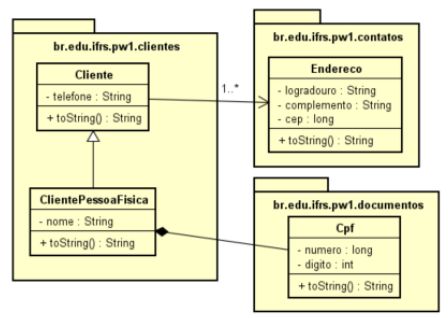

# PW1

#Exercicio:
1) Crie as classes do diagrama de classes

2) Agora, monte o menu abaixo usando coleções:
  - Cadastrar Cliente Pessoa Física
  - Pesquisar Cliente Pessoa Física pelo nome
  - Pesquisar Cliente Pessoa Física pelo CPF
  - Pesquisar Cliente Pessoa Física pelo endereço
  - Listar todos os CLientes
  - Sair
 
 #Diagrama de classes:
 
  
  
