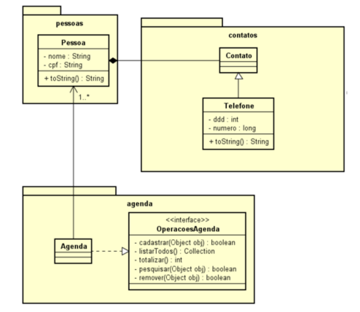

# PW1

1) Criar as classes do diagrama

2) Criar a interface genérica OperacoesAgenda

3) Usar um conjunto ordenado para criar a classe agenda genérica que implementa a interface OperacoesAgenda 

4) A classe Pessoa deve ser ordenada pelo nome

5) Criar uma classe MenuAgenda com os itens
   1) Cadastrar uma pessoa
   2) Listar todas as pessoas ordenadas pelo
       nome
   3) Listar o número total de contatos e
       informar se a agenda está ou não vazia
   4) Pesquisar se uma pessoa está na agenda
       agenda
   5) Sair da agenda

Diagrama de classes:

